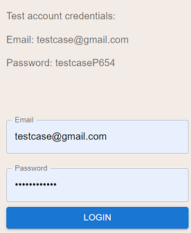
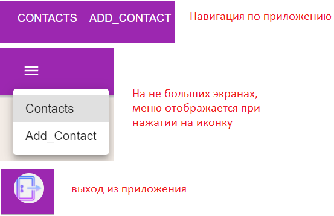
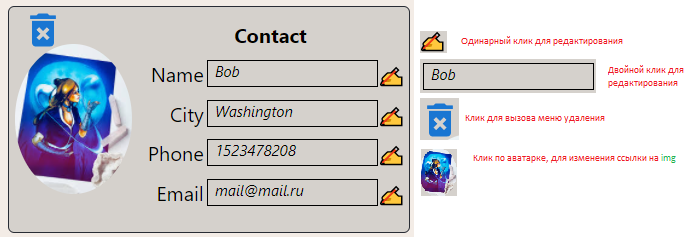
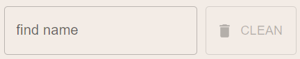
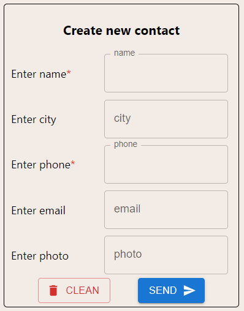

# Приложение "Contacts" готово к использованию через GH-pages
## Приложение адаптировано для мобильных телефонов

Ссылка на приложение [https://paul-bel.github.io/Contacts/](https://paul-bel.github.io/Contacts/)
Страница с контактами и страница с добавлением контакта, разделены роутами(это отклонение от тестового, сделано исходя из возможности отразить больший функционал, объединить проще).

## В приложении использованы библиотеки:
### `react` `axios` `react-router-dom`
### `redux` `redux-thunk` `uuid`

## Описание функционала:
Для реализации серверной части, использован моковый сервер.

Авторизация "условная", вместо Cookie используется Session Storage.
Для авторизации, введите данные указанные на странице авторизации:

Навигация и logout:

Функционал карточки контакта:

На странице с контактами, реализован поиск по имени контакта:

Для добавления нового контакта, обязательно ввести имя и номер телефона.
При успешном создании контакта, новая карточка отобразится на текущей странице и будет доступна в общем поле контактов.

Инпуты для редактирования и создания нового контакта - разные, чтобы отразить вариации применения.
При отправке или получении данных сервера, дизейблятся кнопки и включается прелоадер.
Реализована основная валидация при авторизации, вводе данных, редактировании данных.
### Для оптимизации можно использовать следующие инструменты:
React-Memo, UseMemo, UseCallback, HOCs.
Вынос функций валидации и типизации повторно используемых элементов в Helpers(преимущественно инпутов).

